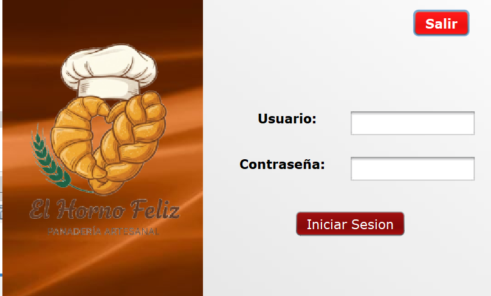
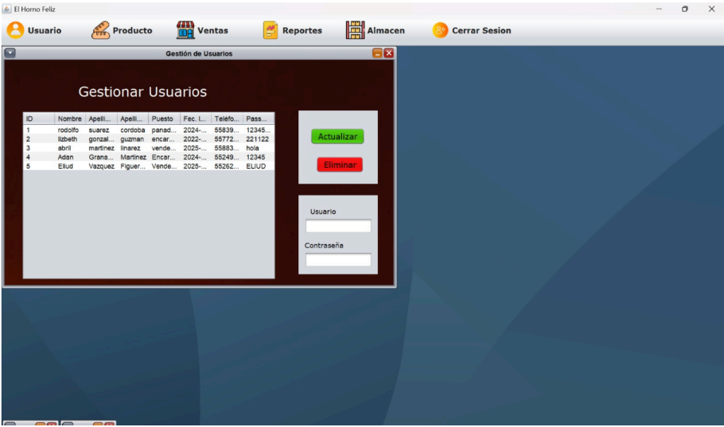
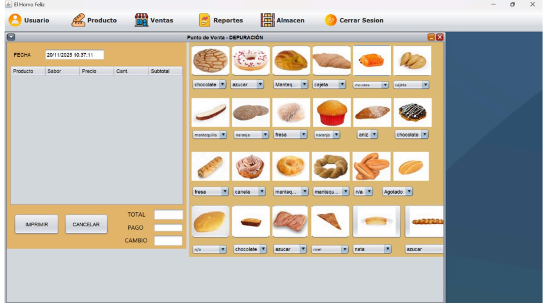

# 🥖 El Horno Feliz — Sistema de Punto de Venta

Sistema de punto de venta desarrollado en Java con interfaz gráfica (Swing) y base de datos MySQL, orientado a la gestión integral de una panadería artesanal.

---

## 📋 Funcionalidades

- **Login** con autenticación de usuario y contraseña
- **Gestión de usuarios** — registro de empleados con nombre, puesto, fecha de ingreso y contraseña
- **Gestión de productos** — alta, actualización y eliminación de productos con imagen y sabor
- **Punto de venta** — selección visual de productos, cálculo automático de total, pago y cambio, e impresión de ticket
- **Reportes** — consulta de ventas realizadas
- **Almacén** — control de inventario de productos

---

## 🛠️ Tecnologías utilizadas

- **Java** — Programación Orientada a Objetos (POO)
- **Java Swing** — Interfaz gráfica de escritorio
- **MySQL** — Base de datos relacional
- **JDBC / Patrón MVC** — Arquitectura Modelo-Vista-Controlador

---

## 🗂️ Estructura del proyecto

```
Panaderia/
├── Conexion/       # Conexión a base de datos
├── Controlador/    # Lógica de negocio
├── Modelo/         # Clases y entidades
├── Ventanas/       # Interfaces gráficas (Swing)
├── Utilidades/     # Funciones auxiliares
└── img/            # Imágenes de productos
```

---

## ⚙️ Requisitos

- Java JDK 8 o superior
- MySQL 5.7 o superior
- NetBeans IDE (recomendado)

---

## 🚀 Cómo ejecutar

1. Clona el repositorio
2. Importa el proyecto en NetBeans
3. Crea la base de datos en MySQL y configura las credenciales en la carpeta `Conexion/`
4. Ejecuta el proyecto desde NetBeans

---

## 📸 Capturas de pantalla

### Login


### Menú principal


### Punto de venta


---

## 👨‍💻 Autor

**Adán Leonardo Granados Martínez**  
Estudiante de Ingeniería en Tecnologías de la Información e Innovación Digital  
[LinkedIn](https://www.linkedin.com/in/adán-leonardo-granados-martínez-6b1589251)
